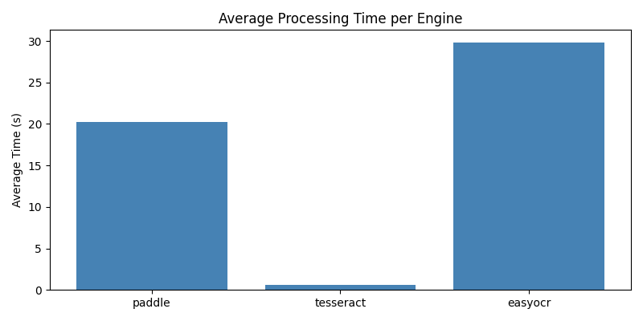
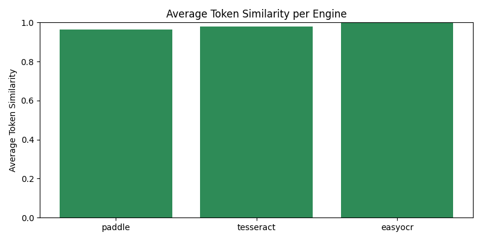
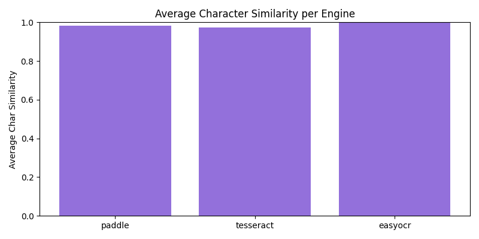
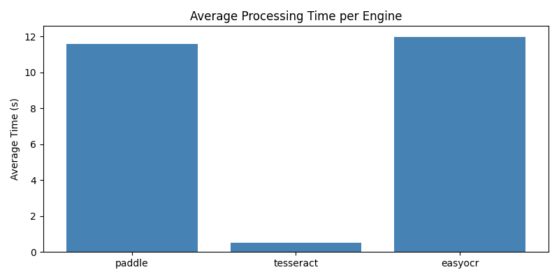
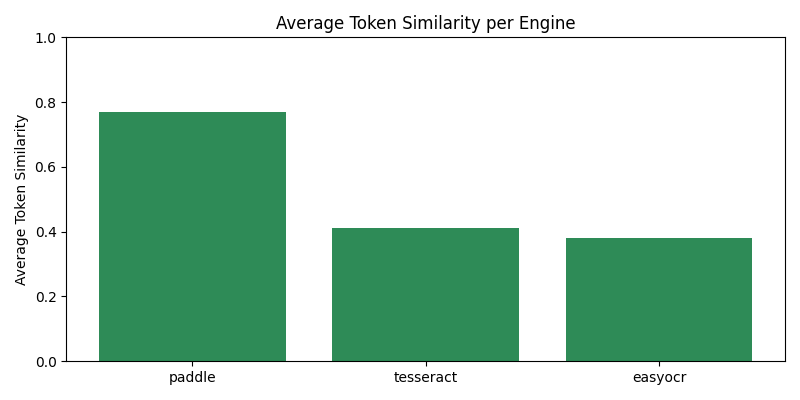
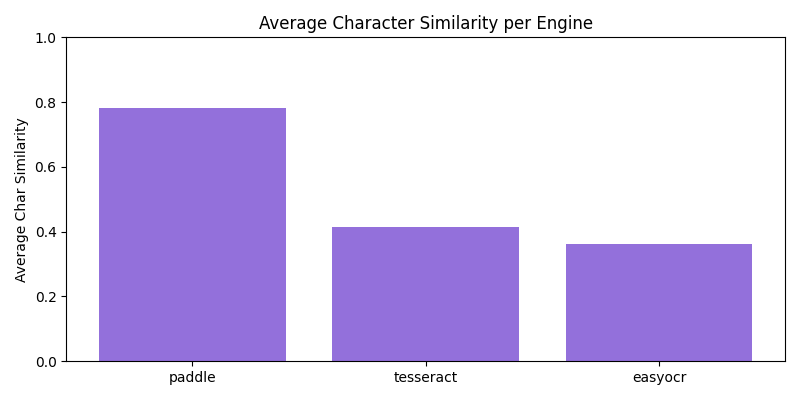

# API OCR

API REST construída com FastAPI que recebe PDFs digitalizados (até 30 páginas), executa OCR local com PaddleOCR e devolve o texto extraído linha a linha no formato `[x:<valor>, y:<valor>, caps:<valor>] texto`.

## Requisitos e instalação

1. Instale as dependências com [uv](https://docs.astral.sh/uv/):
   ```bash
   uv sync
   ```
2. Ative o ambiente virtual ou prefixe os comandos com `uv run`:
   ```bash
   # Linux/macOS
   source .venv/bin/activate
   
   # Windows PowerShell
   & .venv\Scripts\Activate.ps1
   ```

## Executando a API

```bash
uv run uvicorn app.main:app --reload
```

### Endpoint disponível
- `POST /upload` - recebe o PDF no campo `file` do formulário `multipart/form-data`.

Exemplo de requisição:
```bash
# Linux/macOS
curl -X POST http://127.0.0.1:8000/upload \
  -F "file=@sample.pdf;type=application/pdf"

# Windows CMD
curl.exe -X POST http://127.0.0.1:8000/upload ^
  -F "file=@sample.pdf;type=application/pdf"
```

A resposta é `text/plain`, cada linha contendo coordenadas normalizadas e a razão de letras maiúsculas, por exemplo:
```
[x:0.12, y:0.08, caps:0.86] NOME DO CLIENTE: JOÃO DA SILVA
```

> **Observação:** PaddleOCR roda no CPU por padrão e pode levar ~10-20 s por página. Para reduzir a latência, considere diminuir o DPI, aplicar downscale ou usar builds com GPU.

## Idioma do OCR

Por padrão a API inicializa o PaddleOCR com suporte ao idioma inglês ("en").

Bash:
```bash
OCR_LANG=pt uv run uvicorn app.main:app --reload
```

## Benchmarks

Disponibilizamos dois scripts:
- `scripts/benchmark_ocr.py` - avalia o conjunto `dataset-high-quality/`.
- `scripts/benchmark_funsd.py` - avalia o conjunto `dataset-funsd/`.

Ambos aceitam:
- `--engines` (`paddle`, `tesseract`, `easyocr`).
- `--downscale` para redimensionar páginas antes do OCR.
- `--export-results` para salvar as saídas em `results/<engine>/<arquivo>_<engine>.txt`.
- Geração automática de gráficos (`matplotlib`) salvos em `assets/`.

Exemplo (FUNSD):
```bash
# Linux/macOS
uv run python scripts/benchmark_funsd.py \
  --engines paddle tesseract easyocr \
  --limit 50 \
  --export-results

# Windows PowerShell
uv run python scripts/benchmark_funsd.py `
  --engines paddle tesseract easyocr `
  --limit 50 `
  --export-results
```

Exemplo com -m (engine única):
```bash
uv run python -m scripts.benchmark_funsd --engines paddle --limit 10 --export-results
```

Exemplo rodando engine diretamente com imagem:
```bash
uv run python -m engines.paddle sample.pdf --lang en
```

## Resultados (Dataset High-Quality)





| Engine        | Tempo médio (s) | Similaridade (token)  | Similaridade (caracteres)  |
|---------------|-----------------|-----------------------|----------------------------|
| Paddle        | 20,26           | 0,965                 | 0,984                      |
| **Tesseract** | **0,59**        | **0,980**             | **0,972**                  |
| EasyOCR       | 29,83           | **0,997**             | **0,997**                  |

**Legenda das métricas**
- *Token*: comparação feita após normalizar o texto (minúsculas e remoção de pontuação), preservando os espaços para avaliar a sequência de palavras.
- *Caractere*: comparação após manter apenas caracteres alfanuméricos; mede quão semelhantes são as cadeias em nível de letra/dígito.
- *Similaridade*: valor entre 0 e 1 (quanto mais próximo de 1, mais idêntico ao ground truth).

**Insights**
- *Precisão*: Todos os engines alcançaram excelente precisão no dataset high-quality, com EasyOCR liderando em similaridade (0,997), seguido por Tesseract (0,980 token / 0,972 char) e Paddle (0,965 token / 0,984 char).
- *Velocidade*: Tesseract mantém sua vantagem de velocidade (0,59s) mesmo com alta qualidade, seguido por Paddle (20,26s) e EasyOCR (29,83s).
- *Dataset específico*: Este dataset contém imagens de alta qualidade, onde todos os engines performam muito bem, demonstrando que a qualidade da imagem é crucial para resultados precisos.
- *Trade-off*: Para documentos de alta qualidade, Tesseract oferece o melhor custo-benefício (velocidade + boa precisão), EasyOCR oferece a melhor precisão quando velocidade não é crítica, e Paddle fica no meio-termo.

## Resultados (Dataset FUNSD)





| Engine     | Tempo médio (s) | Similaridade (token) | Similaridade (caracteres) |
|------------|-----------------|-----------------------|----------------------------|
| **Paddle** | 11,59           | **0,771**             | **0,783**                  |
| Tesseract  | 0,53            | 0,410                 | 0,413                      |
| EasyOCR    | 11,98           | 0,379                 | 0,362                      |

**Legenda das métricas**
- *Token*: comparação feita após normalizar o texto (minúsculas e remoção de pontuação), preservando os espaços para avaliar a sequência de palavras.
- *Caractere*: comparação após manter apenas caracteres alfanuméricos; mede quão semelhantes são as cadeias em nível de letra/dígito.
- *Similaridade*: valor entre 0 e 1 (quanto mais próximo de 1, mais idêntico ao ground truth).

**Insights**
- *Precisão*: PaddleOCR gera transcrições mais fiéis em um dataset mais diverso, mantendo média de ~0,78 nos caracteres.
- *Velocidade*: Tesseract é muito rápido (~0,5 s/doc) porém com perda acentuada de acurácia.
- *EasyOCR*: fica no meio-termo, com tempo próximo ao Paddle, mas menos preciso.
- *Trade-off*: utilize PaddleOCR quando qualidade é prioridade em arquivos variados; Tesseract serve para extrações rápidas de baixa exigência, com documentos simples e de alta qualidade.

Os arquivos exportados seguem o padrão `nomeoriginal_engine.txt` no diretório `results/`.

## Próximos passos

- **Validar latência e acurácia**: Definir se a latência (~10-20s por documento) e acurácia (~78% de similaridade em documentos complexos) atendem aos requisitos do projeto em cenários reais.
- **Otimizar performance**: Caso a latência não seja aceitável, revisar configurações (DPI/downscale), hardware e alternativas de OCR.
- **Considerar LLMs especializados**: Para acelerar ainda mais mantendo qualidade, avaliar serviços com LLMs como [dots.ocr](https://github.com/rednote-hilab/dots.ocr) que podem oferecer melhor trade-off entre velocidade e precisão.
